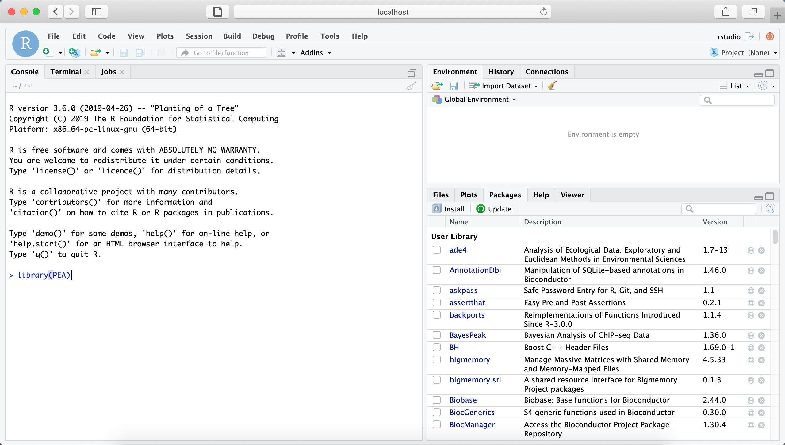

## PEA installation
### rstudio version
```bash
docker pull malab/pea:v1.1_rstudio
```
### R version
  For Mac OS X and Linux operating systems, open the terminal, for Windows operating system, open CMD. Typing the following command:
```bash
# Pull PEA from Docker Hub
$ docker pull malab/pea:v1.1
```
### Quickly start

Once PEA is installed successfully, type the following command to start PEA: 
- For **rstudio version**
```bash
docker run -d -p 8787:8787 -v /host directory of dataset:/home/rstudio -e ROOT=TRUE -e PASSWORD=pea malab/pea:v1.2_rstudio
```
Then an rstudio-server with pre-installed PEA can be accessed via: http://localhost:8787 (**Username: rstudio; password: pea**)

- For **R version**
```bash
$ docker run -it -v /host directory of dataset:/home/data malab/pea R  
```
**Note:** Supposing that users’ private dataset is located in directory ___`/home/test`____, then change the words above (____`/host directory of dataset`____) to host directory (____`/home/test`____)  
```R
library(PEA)  
setwd("/home/data/")  
```
**Important:** the directory (____`/home/data/`____) is a virtual directory in PEA Docker image. In order to use private dataset more easily, the parameter “-v” is strongly recommended to mount host directory of dataset to PEA image.  